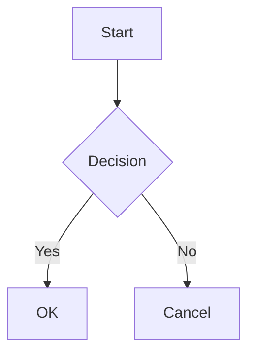

# Markdown Editor App

Une application d'édition Markdown moderne avec gestion de projets et de notes, inspirée du design d'Arc Browser.


## Fonctionnalités

- **Gestion de Projets**
  - Organisation des notes par projets
  - Codes couleur personnalisables
  - Vue d'ensemble des projets

- **Éditeur Markdown Avancé**
  - Interface moderne et intuitive avec CodeMirror 6
  - Prévisualisation en temps réel
  - Support des thèmes clair/sombre
  - Barre d'outils de formatage
  - Mode sans distraction
  - Numérotation des lignes
  - Mise en évidence de la syntaxe
  - Autocomplétion et fermeture automatique des parenthèses

- **Diagrammes et Formules**
  - Support des diagrammes Mermaid
  - Formules mathématiques avec KaTeX
  - Rendu en temps réel
  - Styles adaptés au thème

- **Tags et Organisation**
  - Système de tags colorés
  - Filtrage des notes par tags
  - Organisation flexible

- **Gestion des Tâches**
  - Liste de tâches par note
  - Suivi des tâches terminées
  - Dates d'échéance

- **Export**
  - Export en PDF
  - Mise en page optimisée

## Pour Commencer

### Prérequis

- Node.js (v16 ou supérieur)
- npm ou yarn

### Installation

1. Clonez le dépôt :
```bash
git clone [url-du-repo]
cd markdownEditorApp
```

2. Installez les dépendances :
```bash
npm install
```

3. Lancez l'application en mode développement :
```bash
npm run dev
```

L'application sera accessible à l'adresse `http://localhost:5173`

## Technologies Utilisées

- **Frontend**
  - React 18
  - TypeScript
  - Material-UI (MUI)
  - CodeMirror 6
  - Mermaid
  - KaTeX
  - Emotion (CSS-in-JS)

- **État et Stockage**
  - React Context
  - LocalStorage pour la persistance

- **Outils de Développement**
  - Vite
  - ESLint
  - Jest pour les tests

## Structure du Projet

```
markdownEditorApp/
├── src/
│   ├── components/      # Composants React
│   ├── contexts/        # Contextes React
│   ├── hooks/          # Hooks personnalisés
│   ├── theme/          # Configuration du thème
│   ├── types/          # Types TypeScript
│   └── utils/          # Utilitaires
├── public/             # Assets statiques
└── tests/              # Tests unitaires
```

## Personnalisation

### Thème

L'application supporte les thèmes clair et sombre, avec une adaptation automatique des composants :
- Éditeur
- Prévisualisation
- Diagrammes
- Formules mathématiques

### Raccourcis Clavier

- `Ctrl/Cmd + S` : Sauvegarde manuelle
- `Ctrl/Cmd + P` : Export PDF
- `Ctrl/Cmd + F` : Recherche
- `Ctrl/Cmd + B` : Texte en gras
- `Ctrl/Cmd + I` : Texte en italique
- `Ctrl/Cmd + K` : Insérer un lien

### Syntaxe des Diagrammes

L'application supporte les diagrammes Mermaid. Exemple :

````markdown

````

### Syntaxe des Formules

Les formules mathématiques utilisent KaTeX :
- Inline : `$E = mc^2$`
- Block : `$$\sum_{i=1}^n x_i$$`

## Contribution

Les contributions sont les bienvenues ! N'hésitez pas à :

1. Fork le projet
2. Créer une branche (`git checkout -b feature/AmazingFeature`)
3. Commit vos changements (`git commit -m 'Add some AmazingFeature'`)
4. Push sur la branche (`git push origin feature/AmazingFeature`)
5. Ouvrir une Pull Request

## Licence

Ce projet est sous licence MIT. Voir le fichier `LICENSE` pour plus de détails.

## Remerciements

- [CodeMirror](https://codemirror.net/) pour l'éditeur de texte
- [Mermaid](https://mermaid-js.github.io/) pour les diagrammes
- [KaTeX](https://katex.org/) pour les formules mathématiques
- [Material-UI](https://mui.com/) pour les composants UI

---

Fait avec ❤️ pour la productivité et l'organisation
